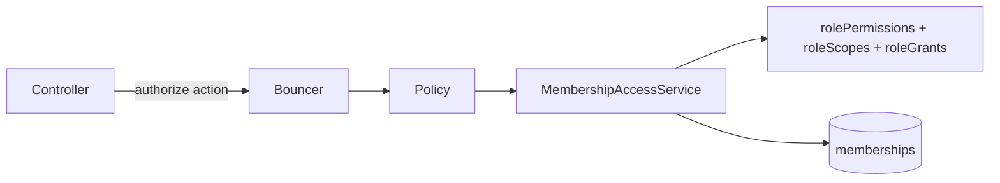

# Authorization: Roles, Permissions, and Scope

This document is a quick map of access rules in Loyalty Nest. The code remains the source of truth:

- `api/app/authorization/permissions.ts` — all available permissions.
- `api/app/authorization/roles.ts` — role configuration.
- `api/app/services/access/membership_access_service.ts` — access evaluation.
- `api/app/policies/` — rules for individual application actions.

## How access is decided

For role-management actions, one more rule applies:

```text
allowed = permission AND scope AND role may manage target role
```

## Role overview

| Role            | Scope       | Purpose                                               | Can manage roles               |
| --------------- | ----------- | ----------------------------------------------------- | ------------------------------ |
| `admin`         | Platform    | Full platform administration                          | All roles                      |
| `company_owner` | One company | Manage a company, its venues, and its loyalty program | `venue_manager`, `venue_staff` |
| `venue_manager` | One venue   | Manage one venue and its staff                        | `venue_staff`                  |
| `venue_staff`   | One venue   | Perform daily venue operations                        | None                           |

### Scope at a glance

| Scope      | Can access                                 |
| ---------- | ------------------------------------------ |
| `platform` | Every company and venue                    |
| `company`  | One company and all venues belonging to it |
| `venue`    | One specific venue only                    |

Example: a manager assigned to venue `A` may update venue `A`, but never venue `B`. A permission such as `venue.update` describes **what** the user may do; scope describes **where** they may do it.

## Permission matrix

| Area            | Permission                    | Admin | Company owner | Venue manager | Venue staff |
| --------------- | ----------------------------- | :---: | :-----------: | :-----------: | :---------: |
| Platform        | `platform.access`             |   ✓   |       —       |       —       |      —      |
| Company         | `company.create`              |   ✓   |       —       |       —       |      —      |
| Company         | `company.view`                |   ✓   |       ✓       |       —       |      —      |
| Company         | `company.update`              |   ✓   |       ✓       |       —       |      —      |
| Company         | `company.delete`              |   ✓   |       —       |       —       |      —      |
| Venue           | `venue.create`                |   ✓   |       ✓       |       —       |      —      |
| Venue           | `venue.dashboard.view`        |   ✓   |       ✓       |       ✓       |      ✓      |
| Venue           | `venue.update`                |   ✓   |       ✓       |       ✓       |      —      |
| Venue           | `venue.delete`                |   ✓   |       ✓       |       —       |      —      |
| NFC             | `nfcTag.manage`               |   ✓   |       ✓       |       ✓       |      —      |
| Loyalty program | `loyaltyProgram.create`       |   ✓   |       ✓       |       —       |      —      |
| Loyalty program | `loyaltyProgram.viewInactive` |   ✓   |       ✓       |       —       |      —      |
| Loyalty program | `loyaltyProgram.update`       |   ✓   |       ✓       |       —       |      —      |
| Loyalty program | `loyaltyProgram.deactivate`   |   ✓   |       ✓       |       —       |      —      |
| Loyalty program | `loyaltyProgram.delete`       |   ✓   |       —       |       —       |      —      |
| Membership      | `membership.assign`           |   ✓   |       ✓       |       ✓       |      —      |
| Membership      | `membership.changeRole`       |   ✓   |       ✓       |       ✓       |      —      |
| Membership      | `membership.revoke`           |   ✓   |       ✓       |       ✓       |      —      |
| Rewards         | `redemption.create`           |   ✓   |       ✓       |       ✓       |      ✓      |

Permission names are documented inline in `permissions.ts`.

## Role management rules

Having a membership permission is not enough. The target role must also be allowed by `roleGrants`.

| Actor role      | May assign, change, or revoke                            |
| --------------- | -------------------------------------------------------- |
| `admin`         | `admin`, `company_owner`, `venue_manager`, `venue_staff` |
| `company_owner` | `venue_manager`, `venue_staff` in their company          |
| `venue_manager` | `venue_staff` in their venue                             |
| `venue_staff`   | Nothing                                                  |

Examples:

- A company owner cannot create another company owner.
- A venue manager cannot create, demote, or revoke another venue manager.
- A venue manager may assign or revoke `venue_staff` in their own venue only.

## Where policies fit



A policy translates an application action into a permission and scope:

```ts
return this.access.allows(user, "venue.update", {
  type: "venue",
  companyId: venue.companyId,
  venueId: venue.id,
});
```

Controllers must enforce the policy before changing data:

```ts
await bouncer.with(VenuePolicy).authorize("update", venue);
```

`allows()` returns `true` or `false`. `authorize()` returns `403 Forbidden` when access is denied.

## Changing the configuration

### Add or remove an existing permission from a role

Update `rolePermissions` in `api/app/authorization/roles.ts`, then update the relevant policy tests. No database migration is needed.

### Add a new permission

1. Add it to `permissions.ts` with a short comment.
2. Add it to the intended roles in `rolePermissions`.
3. Check it in the appropriate policy with the correct scope.
4. Call that policy from the controller with `authorize()`.
5. Add allowed, denied, and cross-scope tests.

`admin: permissions` means admins automatically receive every new permission.

### Add a new role

1. Add the role to `rolePermissions`.
2. Define its entry in `roleScopes` and `roleGrants`.
3. Update role-specific TypeScript helpers and request validators.
4. Create a new migration for the `memberships` role and scope constraints.
5. Add policy tests for permissions, scope, and role management.

Do not edit an already-run migration. Roles are stored in the `memberships` table, so PostgreSQL must explicitly allow a new role value.

## Tests

Policy tests live in `api/tests/functional/policies/`:

| File                             | Covers                                              |
| -------------------------------- | --------------------------------------------------- |
| `company_policy.spec.ts`         | Company access and company scope                    |
| `venue_policy.spec.ts`           | Venue access and venue scope                        |
| `loyalty_program_policy.spec.ts` | Program visibility and configuration                |
| `membership_policy.spec.ts`      | Role assignment, changes, revocation, and hierarchy |

These tests call Bouncer directly. HTTP endpoint tests should additionally verify that denied requests return `403`.
