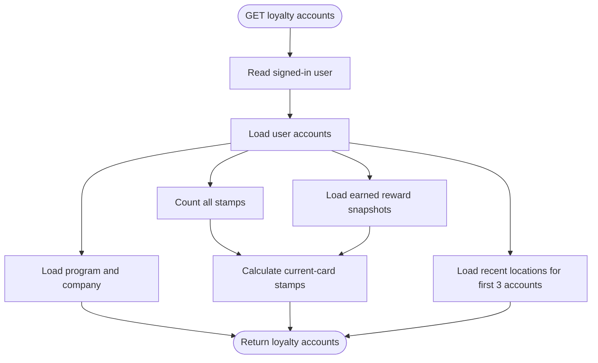

# Loyalty Accounts Flow

`GET /api/v1/me/loyalty_accounts` returns the user's stamp cards and recent locations. It does not return rewards.

## Response rules

- `program.stampCount` is the number of stamps on the current card.
- `program.stampsRequired` is the card threshold.
- Current-card progress is all account stamps minus stamps assigned to earned rewards.
- All user accounts are returned. Only the first three accounts include up to two recent locations.
