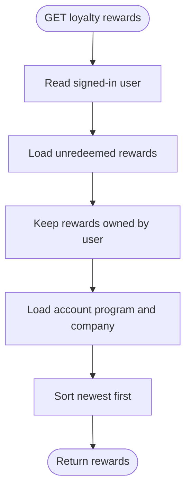

# Loyalty Rewards Flow

`GET /api/v1/me/loyalty_rewards` returns the signed-in user's unredeemed rewards, newest first.

## Response rules

- A reward is available when `redeemed_at` is `NULL`.
- Every returned reward includes its loyalty account, program, and company context.
- The first returned item is the latest available reward for a future dashboard view.
