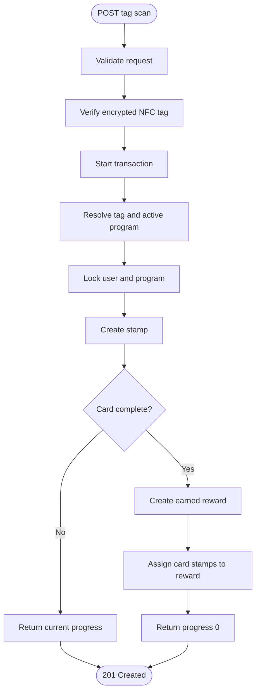

# Tag Scan Flow

`POST /api/v1/tag_scans` creates one stamp from a verified NFC read and awards a reward only when that stamp completes the current card.

## Rules

- The verified tag determines the venue and loyalty program; the request never chooses them.
- A user has one loyalty account per program. An advisory lock covers first scans, then `FOR UPDATE` locks the account row.
- Only stamps with `earned_reward_id = NULL` belong to the current card.
- A completed card creates one `earned_rewards` row and assigns its exact stamps to it.
- The unique `(nfc_tag_id, nfc_counter)` constraint rejects a repeated NFC counter with `409`.
- Stamp creation, reward creation, stamp assignment, and the response happen in one transaction.

## Response

When the card is not complete, `earnedReward` is `null` and `progress.collectedStamps` is the current-card count. When a card is complete, `earnedReward` contains only the reward created by that scan and progress resets to zero.

## Current limitations

- Program version transitions and redemption by venue staff are not implemented.
- `stamps_required` must not change while users collect a card; new terms require a new program.
- Verifier transport failures and timeouts currently become generic server errors.
