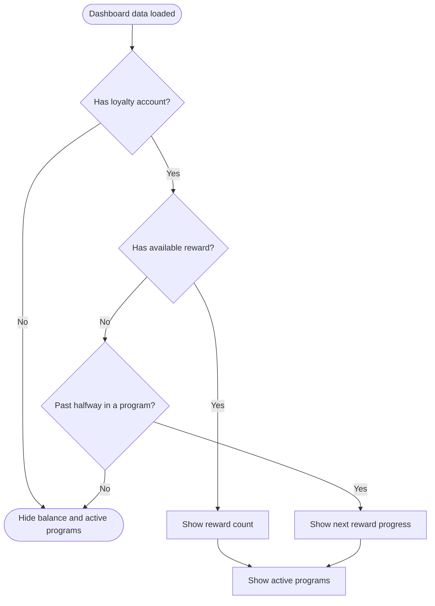

# Reward Balance Visibility

The dashboard loads loyalty accounts and available rewards in parallel. The reward-balance panel and the `Active programs` label always appear together.

## Rules

- An available reward has `redeemedAt = null`.
- When one or more available rewards exist, the panel displays their count.
- With no available rewards, the panel appears only when `stampCount > stampsRequired / 2` for at least one program.
- In that state, it displays the closest next reward and its remaining stamp count.
- Without a loyalty account, or before passing halfway without a reward, both the panel and `Active programs` label are hidden.
