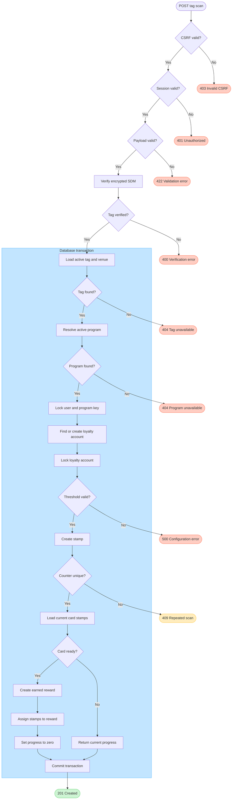

# NFC Tag Scan and Reward Flow

## Scope

This document describes the current behavior of `POST /api/v1/tag_scans`, including NFC verification, stamp creation, reward awarding, concurrency, and replay protection.

## Domain rules

1. The authenticated session supplies the user ID. The request must never select a user, company, venue, program, or loyalty account.
2. The NFC verifier must validate the encrypted SDM values before any database transaction or state change begins.
3. The verified tag identifier resolves an active NFC tag and its venue on the server.
4. The venue's company resolves the active loyalty program on the server.
5. A loyalty account is created lazily on the user's first accepted scan. A user has at most one account per program.
6. One accepted NFC counter creates exactly one stamp. The unique constraint on `(nfc_tag_id, nfc_counter)` is the replay-protection source of truth.
7. `stamps_required` is a positive integer and does not change while users collect a card. Different terms require a new loyalty program.
8. One scan awards at most one reward.
9. Only stamps whose `earned_reward_id` is `NULL` belong to the current stamp card.
10. A reward is ready when the number of current-card stamps reaches `stamps_required`.
11. Awarding creates one `earned_rewards` record and assigns the exact current-card stamps to it through `stamps.earned_reward_id`.
12. The reward snapshots its title and required stamp count when earned.
13. An unredeemed reward does not block collection of the next stamp card. A user may hold multiple unredeemed rewards.
14. `earnedReward` in the scan response is only the reward created by that scan. It is `null` when the scan did not complete a card.
15. Stamp creation, reward creation, stamp assignment, and returned progress belong to one database transaction. Any failure rolls back all of them.
16. `GET /api/v1/me/loyalty_accounts` returns stamp-card progress only. `GET /api/v1/me/loyalty_rewards` returns the user's unredeemed rewards, newest first.

## Concurrency rules

- A transaction-scoped PostgreSQL advisory lock serializes scans for the same user and loyalty program before a loyalty-account row exists.
- The loyalty-account row is then locked with `FOR UPDATE`.
- Current-card stamp rows are also locked with `FOR UPDATE` before reward eligibility is evaluated.
- Different users or different programs use different advisory-lock keys and may proceed concurrently.

## Flow



## Successful response

When the scan does not complete a card:

```json
{
  "earnedReward": null,
  "loyaltyAccountId": 12,
  "progress": {
    "collectedStamps": 4,
    "stampsRequired": 10
  },
  "stampId": 98,
  "venueId": 3
}
```

When the scan completes a card, `earnedReward` contains the reward created by that scan and `collectedStamps` resets to zero.

The dashboard obtains stamp-card progress from `GET /api/v1/me/loyalty_accounts` and available rewards from `GET /api/v1/me/loyalty_rewards`. Rewards include their loyalty-account, company, and program context and are ordered from newest to oldest, so the first item is the latest available reward.

## Current limitations

- Program version transitions are not implemented. The current schema permits one loyalty program per company, and a scan resolves the company's active program before looking up the user's loyalty account. Supporting a new program while existing users finish an old card requires a separate versioning flow.
- Program immutability is currently a domain rule, not a database constraint. Future program-management endpoints must not modify `stamps_required` for an existing program.
- Reward redemption authorization is not implemented. Earned rewards can be displayed but not securely redeemed by venue staff yet.
- NFC verifier transport failures and timeouts currently propagate as generic server errors; non-successful or malformed verifier responses return `400`.
- Functional tests cover authentication, request validation, first-scan account creation, reward thresholds, subsequent cards, concurrent first scans, and repeated counters. They do not yet cover verifier rejection, unknown or inactive tags, or a company without an active program.
